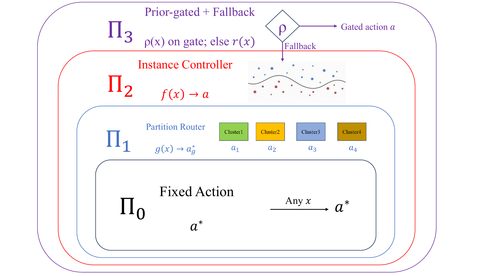

# A Regime Theory of Controller Class Selection for LLM Action Decisions

This paper has been submitted to NeurIPS 2026.



## Project Structure

```
.
├── README.md
├── requirements.txt
├── fig_hierarchy_nested.png
└── src/
    ├── controllers/                       # the four policy classes + L2D + CART
    │   ├── controller_arc_p_v11.py        # shared CV / loss / family utilities
    │   ├── controller_arc_p_v14.py        # Pi_0/Pi_1/Pi_2 strict nested 5-fold-by-5-seed CV
    │   ├── controller_l2d_baselines.py    # cost-sensitive Mozannar + Narasimhan adaptations
    │   └── tree_router_runner.py          # CART partition router (Pi_1 ablation)
    ├── data/                              # action generation, features, loss matrix
    │   ├── gen_actions.py                 # Qwen2.5-VL inference for direct/retrieve/defer
    │   ├── build_action_table.py          # collate VLM outputs into action tables
    │   ├── prep_aokvqa.py                 # A-OKVQA val split preprocessing
    │   ├── build_hallu_candidates_v2.py   # HallusionBench candidate-question selection
    │   ├── build_features_v10.py          # canonical 39/41/12-d scalar feature blocks
    │   ├── build_v10_features_v2.py       # HallusionBench v10 feature rebuild
    │   ├── build_loss_matrix_v4.py        # combine c, h, k into per-sample loss matrix
    │   ├── gen_consistency_v9.py          # K=10 stochastic-sampling uncertainty
    │   ├── gen_selfverify_v9.py           # 3B/7B self-verification probes
    │   ├── gen_blind_probe_v9.py          # modality-bypass probes
    │   ├── extract_image_features.py      # CLIP-style image side features
    │   ├── merge_aokvqa_risk_chunks.py    # parallel risk-job output merger
    │   └── risk/
    │       ├── risk_hallu_v4.py           # InternVL2.5-8B semantic-risk labeling
    │       └── risk_aokvqa_v4.py          # InternVL2.5-8B semantic-risk labeling
    ├── benchmarks/                        # standalone end-to-end pipelines
    │   ├── sms_spam_standalone.py         # TF-IDF + calibrated SVC, residual-bounded
    │   ├── run_folio_pilot.py             # FOLIO end-to-end with rule-based risk
    │   └── textvqa_pi3_ocr.py             # TextVQA-OCR Pi_3 deployable witness (Table 4)
    ├── eval/                              # ablations, diagnostics
    │   ├── strict_cv_ablation.py          # strict-vs-nonstrict CV comparison
    │   ├── strict_K_sweep.py              # K-sweep for KMeans Pi_1
    │   ├── pi2_rich_text_ablation.py      # A-OKVQA Pi_2 with rationale-augmented features (Table 3)
    │   ├── pi3_rationale_prior.py         # A-OKVQA gold-rationale Pi_3 oracle (Table 3)
    │   ├── loss_weight_sensitivity.py     # canonical-weight perturbations (Table 7)
    │   ├── diag_alpha_min.py              # alpha_min / beta computation per benchmark
    │   ├── cluster_anatomy.py             # HallusionBench K=4 partition diagnostics (Fig 5)
    │   └── all_numbers.py                 # exhaustive paper-number aggregation utility
    ├── synthetics/                        # controlled synthetics (Appendix D)
    │   ├── sim_bernstein_cross.py         # bottom-q precision cross-threshold (Fig 6)
    │   ├── synth_regime_phase_v4.py       # Pi_1/Pi_2 phase transition (Fig 7)
    │   ├── synth_pi3_validation.py        # Pi_3 orthogonal-channel sweep (Fig 8)
    │   └── plot_synth_v4.py               # phase-tile plotter for Fig 7
    ├── judge/
    │   └── internvl_judge.py              # InternVL2.5-8B judge wrapper for risk labelers
    └── utils/
        └── bench_loader.py                # benchmark loaders (HuggingFace + local JSON)
```
